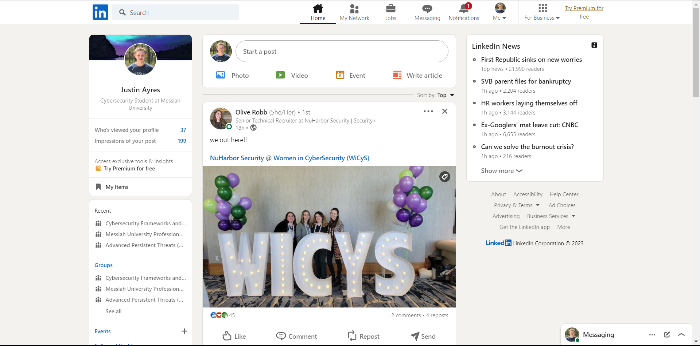
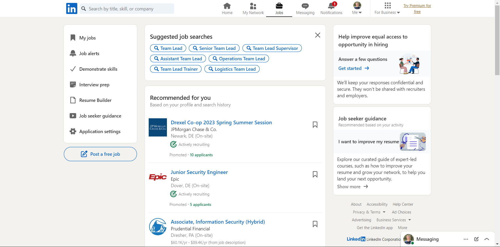
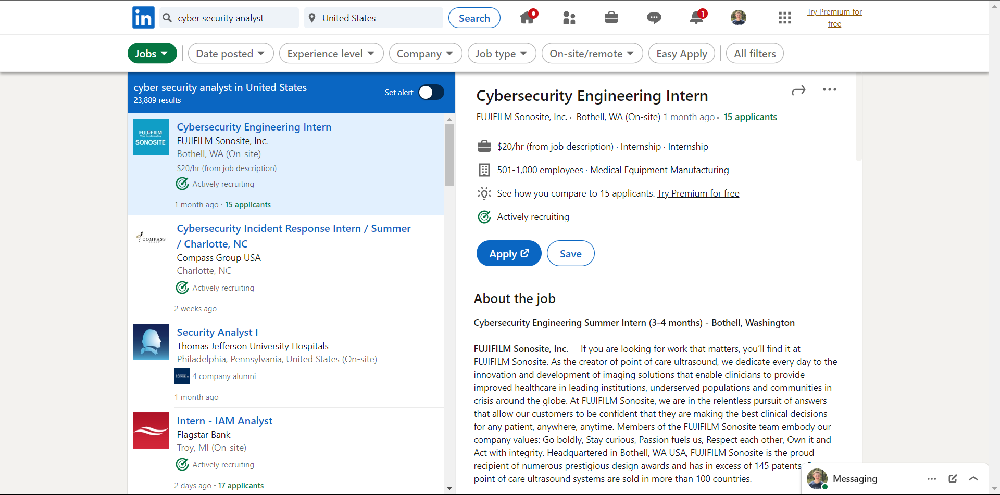
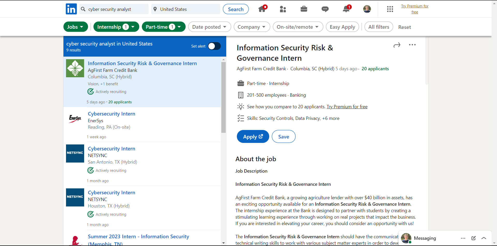
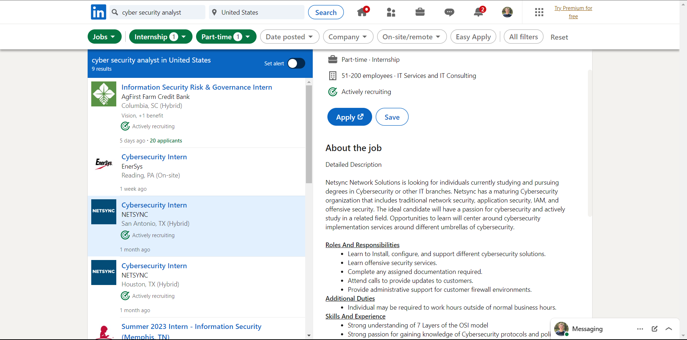
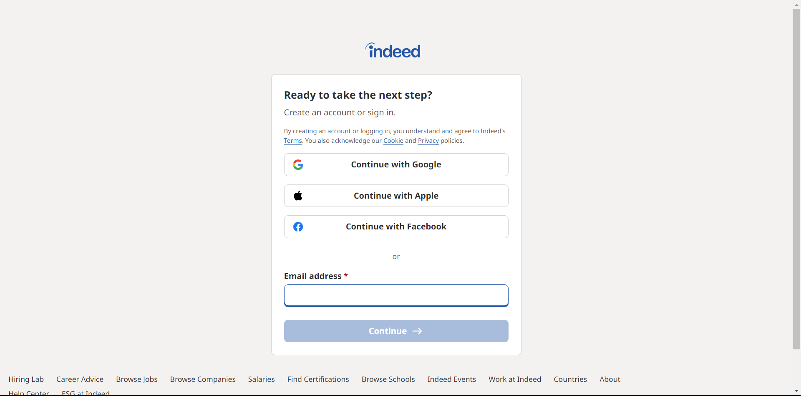
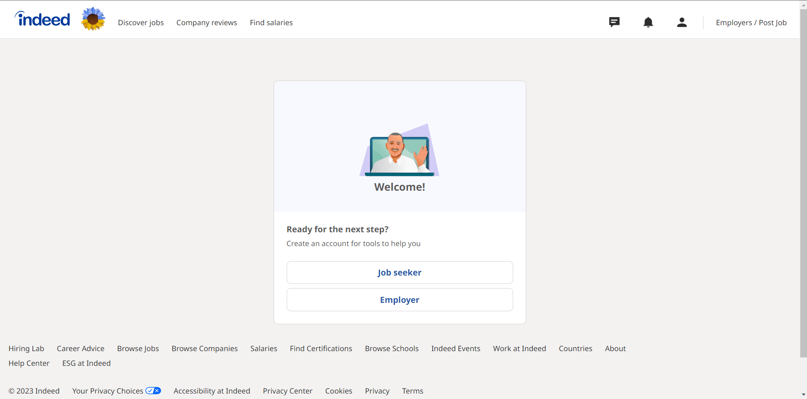
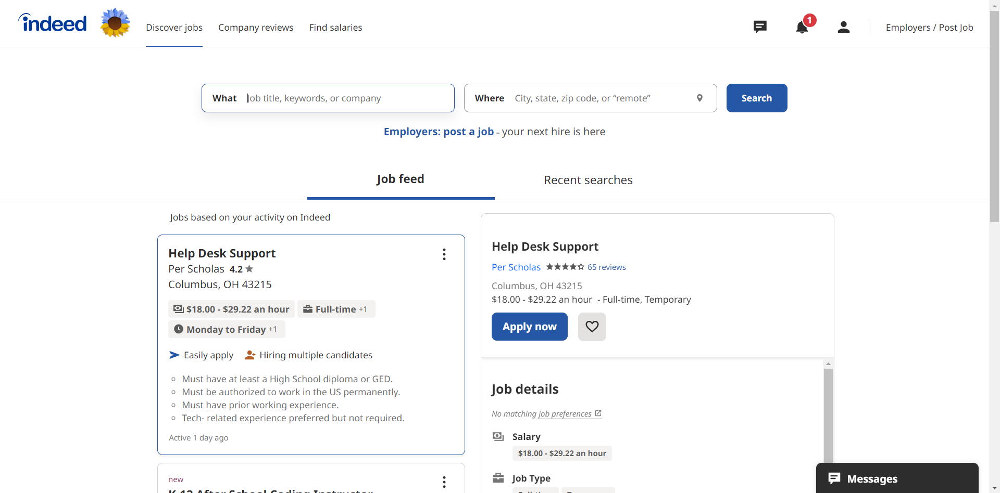
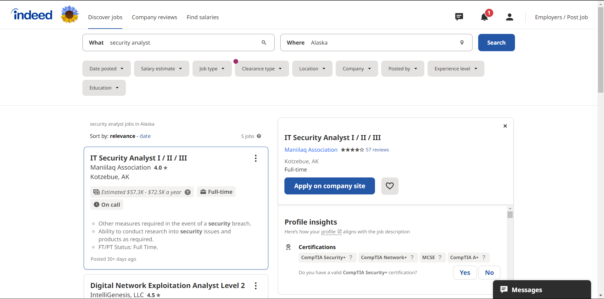
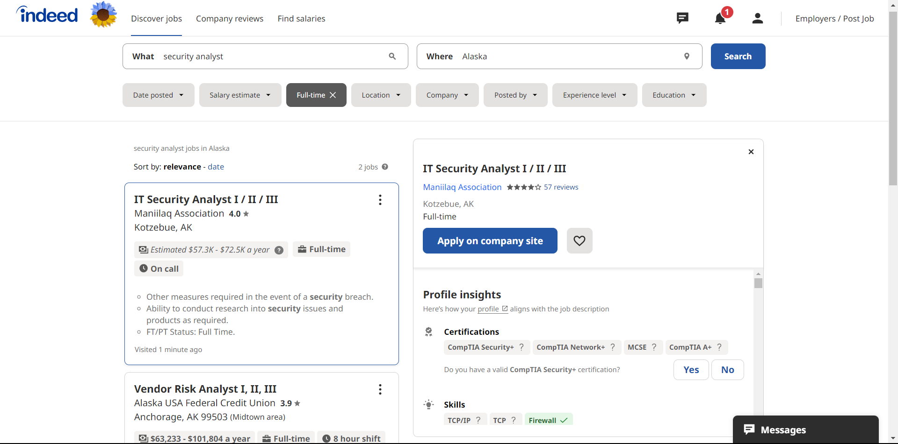

# Lab Report: UX/UI
___
**Course:** CIS 411, Spring 2021  
**Instructor(s):** [Trevor Bunch](https://github.com/trevordbunch)  
**Name:** Justin Ayres 
**GitHub Handle:** JDAyres  
**Repository:** https://github.com/JDAyres/cis411_lab3_uiux  
**Collaborators:** aidan-hubley, Statmosphere, 02NRA, jg1579
___

# Step 1: Confirm Lab Setup
- [x] I have forked the repository and created my lab report
- [x] If I'm collaborating on this project, I have included their handles on the report and confirm that my report is informed, but not copied from my collaborators.

# Step 2: Evaluate Online Job Search Sites

## 2.1 Summary
| Site | Score | Summary |
|---|---|---|
| LinkedIn | 18/21 | Overall, LinkedIn's Job application UI experience is well-designed and user-friendly, with a few areas for improvement in terms of overwhelming layouts and limited filter options. However, the site values the user's time and provides a straightforward application process, and is designed to be accessible to all users. |
| Indeed | 17/21 | Overall, Indeed's job application UI experience is generally user-friendly and effective, but there are some areas for improvement, such as the cluttered job listing page and the confusing profile completion form. The site could also be more accessible to users with disabilities.|

## 2.2 Site 1: LinkedIn

**Step 1:** Navigate to the Jobs tab

What to do: At the top of the screen just to the right right of the center select the "Jobs" tab which is also shown with a brief case logo.

Notes: The LinkedIn UI is generally user-friendly, and this step is straightforward. However, I find the top navigation menu to be a little cluttered.

**Step 2:** Begin Job Search

What to do: Once In the "Jobs" tab, type in the specific job title or field you are interested in, as well as the location where you want to work.

Notes: The search function works well and provides useful suggestions for job titles and locations. However, the search results can be overwhelming, especially for popular job titles, and may require further filtering.

**Step 3:** Viewing Search Result

 What to do: Click the "Search" button to see a list of job openings that match your search criteria.

 Notes: The search results page is well-organized and provides relevant job openings. However, some might find the page layout a little overwhelming or cluttered.

**Step 4:** Narrow Down Your Search

What to do: Use the filters on the left-hand side of the page to narrow down your search results by company, experience level, job function, industry, and more.

Notes: The filters are useful and provide a convenient way to refine search results. However, some users might find the filter options limited or not specific enough.

**Step 5:** Select and View Job

What to do: Click on a job listing to learn more about the position, including the job description, qualifications, and application instructions.

Notes: The job listing page is well-designed and provides relevant information about the job. However, since that this is controlled  by the company the format can vary.

**Step 6:** Start Application Process

What to do: If you are interested in applying for the job, click the "Apply" button and follow the application instructions provided by the employer.

Notes: The application process is straightforward, and the "Apply" button is easy to find. However,since the application process is created by the company the application experience may vary between applications.
| Category | Grade (0-3) | Comments / Justification |
|---|---|---|
| 1. **Don't make me think:** How intuitive was this site? | 2  | The site is generally intuitive, but some users might find the search results page and job listing page overwhelming or cluttered. Additionally, the filter options might be limited for some users. |
| 2. **Users are busy:** Did this site value your time?  | 3  |  	The site is designed to help users find job openings quickly and efficiently, and the search and filter functions are useful and convenient. The application process is straightforward and doesn't waste the user's time. |
| 3. **Good billboard design:** Did this site make the important steps and information clear? How or how not? | 2  |  The important steps and information are generally clear, but some users might find the layout of the search results page and job listing page overwhelming or cluttered. Additionally, the filter options might be limited for some users. |
| 4. **Tell me what to do:** Did this site lead you towards a specific, opinionated path? |  3 |  	The site is designed to help users find job openings quickly and efficiently, and the search and filter functions lead users towards specific job listings. |
| 5. **Omit Words:** How careful was this site with its use of copy? |  3 | The copy on the site is clear and concise, and doesn't use unnecessary words or jargon. |
| 6. **Navigation:** How effective was the workflow / navigation of the site? |  2 | The workflow and navigation of the site are generally effective, but some users might find the search results page and job listing page overwhelming or cluttered. Additionally, the filter options might be limited for some users.  |
| 7. **Accessibility:** How accessible is this site to a screen reader or a mouse-less interface? | 3  | The site is designed to be accessible to users with screen readers or mouse-less interfaces, and includes helpful accessibility features such as alt tags and keyboard shortcuts. |
| **TOTAL** | 18/21  | Overall, LinkedIn's Job application UI experience is well-designed and user-friendly, with a few areas for improvement in terms of overwhelming layouts and limited filter options. However, the site values the user's time and provides a straightforward application process, and is designed to be accessible to all users. |

## 2.3 Site 2: Indeed

**Step 1:** Begin the Process to Create an Indeed Account

What to do: Go to Indeed's website at www.indeed.com and click on the "Sign In" button in the top right corner of the homepage.

Notes: The "Sign In" button is prominently displayed, but it might confuse users who are trying to create a new account.

**Step 2:** Create Your Indeed Account

What to do: Enter your email address and create a password for your account, or sign in with your Google account. You can also choose to sign up using your Google or Facebook account (Thats what I did).

Notes: It's not very clear whether or not you are signing in or creating an account, this can cause users confusion.

**Step 3:** Finish Job Creation

What to do: Complete your profile by stating whether or not you are a Job seeker or and employer, and either upload your resume (what I did) or create an indeed resume.

Notes: The form for completing your profile is somewhat long and might deter users from completing it fully. Additionally, some of the questions might be unclear or confusing to users.

**Step 4:** Begin Searching for Jobs

What to do: Navigate to the "Discover Jobs" tab in the top left of the screen.

Notes: There is a lot of unused  wasted space on this page.

**Step 6:** Search for Jobs

What to do: Start searching for jobs by entering a job title, keyword, or company name in the search bar on the homepage.

Notes: The search bar is prominent and easy to use, but some users might find the search results page overwhelming or cluttered.

**Step 5:** Narrow Down Search

What to do: Use the filters on the left-hand side of the search results page to narrow down your search by location, salary, job type, and more.

Notes: The filters are useful, but some users might find them limited or difficult to use.

**Step 6:** Select Job

What to do: click on a job listing to view the full job description and requirements.

Notes: The job listing page is cluttered with ads and sponsored job postings, which might make it difficult for users to focus on the actual job posting.

**Step 7:**

What to do: Apply for the job by clicking on the "Apply Now" button or following the application instructions provided in the job listing.

Notes: The application process varies depending on the employer, which might cause confusion for some users. Additionally, some users might find the application process too time-consuming or complex.
| Category | Grade (0-3) | Comments / Justification |
|---|---|---|
| 1. **Don't make me think:** How intuitive was this site? |  2 |  The site is generally intuitive and easy to use, but the profile completion form could be clearer and more streamlined. Additionally, the application process varies depending on the employer, which might cause confusion for some users. |
| 2. **Users are busy:** Did this site value your time?  | 3 |  The site values users' time by providing a straightforward search function and application process. However, the cluttered job listing page and long profile completion form might be time-consuming for some users. |
| 3. **Good billboard design:** Did this site make the important steps and information clear? How or how not? |  2 |  The site makes the important steps and information clear, but the cluttered job listing page and limited filter options might make it difficult for users to find the information they need. Additionally, some of the questions on the profile completion form might be unclear or confusing to users. |
| 4. **Tell me what to do:** Did this site lead you towards a specific, opinionated path? |  2 |  	The site does lead users towards a specific path, but the application process varies depending on the employer, which might cause confusion for some users. Additionally, some users might find the profile completion form too long and complex. |
| 5. **Omit Words:** How careful was this site with its use of copy? | 3  | The site is generally careful with its use of copy, but some of the questions on the profile completion form might be confusing or unclear to users.  |
| 6. **Navigation:** How effective was the workflow / navigation of the site? |   3|  	The site has a clear and effective workflow and navigation, with a prominent search bar and useful filter options. However, the cluttered job listing page and limited filter options might make it difficult for users to navigate the site. |
| 7. **Accessibility:** How accessible is this site to a screen reader or a mouse-less interface? | 2  |  The site is generally accessible, but some of the input fields might be small and difficult to use for users with poor eyesight or mobility issues. Additionally, the cluttered job listing page might make it difficult for screen reader users to navigate the site. |
| **TOTAL** |  17/21 |  Overall, Indeed's job application UI experience is generally user-friendly and effective, but there are some areas for improvement, such as the cluttered job listing page and the confusing profile completion form. The site could also be more accessible to users with disabilities. |

# Step 3 Competitive Usability Test

## Step 3.1 Product Use Case

| Use Case #1 | |
|---|---|
| Title | |
| Description / Steps | |
| Primary Actor | |
| Preconditions | |
| Postconditions | |

## Step 3.2 Identifier a competitive product

List of Competitors
1. Competitor 1 [www.awesomesauce.com](www.awesomesauce.com)
2. Competitor 2 [Bangarang Peter](https://www.youtube.com/watch?v=4PNOccSUb1Q)

## Step 3.3 Write a Useability Test

| Step | Tasks | Notes |
|---|---|---|
| 1 |   |   |
| 2 |   |   |
| 3 |   |   |
| ... |   |   |
| n |   |   |

## Step 3.4 Observe User Interactions

| Step | Tasks | Observations |
|---|---|---|
| 1 |   |   |
| 2 |   |   |
| 3 |   |   |
| ... |   |   |
| n |   |   |

## Step 3.5 Findings
Organize your findings here.

# 4. Your UX Rule (Extra Credit)
If you opt to do extra credit, then include it here.